# Deep Research with Claude SDK - 项目架构文档

> 本文档由 AI 自动生成并维护，最后更新时间：2026-01-17 00:50:30

## 变更记录 (Changelog)

### 2026-01-17
- 初始化 AI 上下文文档
- 生成项目架构总览与模块索引
- 添加模块结构图

---

## 项目愿景

**Deep Research Assistant** 是一个基于 Claude Agent SDK 的 AI 驱动研究助手应用，能够：

1. **深度研究**：支持三种研究类型（对比分析、深度分析、摘要总结）
2. **实时流式展示**：通过 Server-Sent Events (SSE) 实时展示研究进度
3. **智能搜索**：集成 WebSearch 工具进行网络搜索与信息聚合
4. **自动引用**：自动为研究结果生成引用链接
5. **历史管理**：基于 SQLite 的研究历史存储与检索
6. **多格式导出**：支持导出为 Markdown 和 PDF
7. **分享功能**：通过 URL 分享研究报告

---

## 架构总览

### 技术栈

| 分类 | 技术选型 |
|------|---------|
| **前端框架** | Next.js 16 (App Router) + React 19 + TypeScript |
| **UI 组件** | Radix UI + shadcn/ui + Tailwind CSS 4 |
| **样式方案** | Tailwind CSS 4 + tw-animate-css |
| **Markdown 渲染** | unified + remark + rehype 生态 |
| **AI 引擎** | @anthropic-ai/claude-agent-sdk (支持 WebSearch/WebFetch 工具) |
| **数据库** | SQLite + Prisma ORM |
| **验证** | Zod |
| **构建工具** | TypeScript + ESLint |
| **包管理** | pnpm |

### 核心依赖

```json
{
  "@anthropic-ai/claude-agent-sdk": "^0.2.5",
  "@prisma/client": "^5.20.0",
  "next": "16.1.1",
  "react": "19.2.3",
  "openai": "^6.16.0",
  "zod": "^4.3.5",
  "react-markdown": "^10.1.0"
}
```

---

## 模块结构图

```mermaid
graph TD
    Root["(根) deep-research-with-claude-sdk"] --> App["app/"];
    Root --> Components["components/"];
    Root --> Lib["lib/"];
    Root --> Prisma["prisma/"];

    App --> AppAPI["api/"];
    App --> AppPages["页面 (page.tsx)"];

    AppAPI --> APIResearch["research/ - 研究任务 API"];
    AppAPI --> APIHistory["history/ - 历史管理 API"];

    Components --> UIComponents["ui/ - 基础 UI 组件"];
    Components --> FeatureComponents["功能组件"];

    FeatureComponents --> ResearchForm["ResearchForm - 研究表单"];
    FeatureComponents --> StreamingCanvas["StreamingCanvas - 实时流式画布"];
    FeatureComponents --> ResultsViewer["ResultsViewer - 结果查看器"];
    FeatureComponents --> HistoryPanel["HistoryPanel - 历史面板"];
    FeatureComponents --> SharedReportViewer["SharedReportViewer - 分享报告"];
    FeatureComponents --> TableOfContents["TableOfContents - 目录导航"];

    Lib --> LibResearch["research/ - 研究服务"];
    LibResearch --> ResearchService["service.ts - Claude Agent SDK 集成"];
    LibResearch --> ResearchPrompts["prompts.ts - 研究提示词"];
    LibResearch --> ResearchTypes["types.ts - 类型定义"];

    Lib --> LibUtils["工具模块"];
    LibUtils --> LibDB["db.ts - Prisma 客户端"];
    LibUtils --> LibMarkdown["markdown.ts - Markdown 处理"];
    LibUtils --> LibShare["share.ts - 分享功能"];
    LibUtils --> LibUtils["utils.ts - 通用工具"];

    Prisma --> PrismaSchema["schema.prisma - 数据模型"];
    Prisma --> PrismaMigrations["migrations/ - 数据库迁移"];

    click AppAPI "./CLAUDE.md#app-api-layer" "查看 API 层文档"
    click Components "./components/CLAUDE.md" "查看组件模块文档"
    click Lib "./lib/CLAUDE.md" "查看库模块文档"
    click Prisma "./prisma/CLAUDE.md" "查看数据层文档"
```



---

## 模块索引

| 模块路径 | 职责描述 | 主要技术/框架 | 状态 |
|---------|---------|--------------|------|
| **app/** | Next.js App Router，包含页面与 API 路由 | Next.js 16, React 19 | ✅ 活跃 |
| **app/api/research/** | 研究任务 API，处理研究请求与 SSE 流式响应 | Next.js API Routes, SSE | ✅ 活跃 |
| **app/api/history/** | 历史记录 API，CRUD 操作 | Next.js API Routes, Prisma | ✅ 活跃 |
| **app/research/** | 研究主页面 | React 19, Client Components | ✅ 活跃 |
| **components/** | React 组件库 | Radix UI, shadcn/ui | ✅ 活跃 |
| **components/ui/** | 基础 UI 组件（按钮、卡片、输入框等） | Radix UI, Tailwind | ✅ 活跃 |
| **components/ResearchForm.tsx** | 研究表单组件 | React Hook Form | ✅ 活跃 |
| **components/StreamingCanvas.tsx** | 实时流式画布，SSE 接收与展示 | Server-Sent Events | ✅ 活跃 |
| **components/ResultsViewer.tsx** | 研究结果查看器 | Markdown 渲染 | ✅ 活跃 |
| **components/HistoryPanel.tsx** | 历史记录侧边栏 | React, Prisma | ✅ 活跃 |
| **components/SharedReportViewer.tsx** | 分享报告查看器 | React, URL 参数 | ✅ 活跃 |
| **lib/research/** | 研究服务核心 | Claude Agent SDK | ✅ 活跃 |
| **lib/research/service.ts** | Claude Agent SDK 集成与流式处理 | @anthropic-ai/claude-agent-sdk | ✅ 活跃 |
| **lib/research/prompts.ts** | 研究提示词模板 | - | ✅ 活跃 |
| **lib/research/types.ts** | 类型定义 | TypeScript | ✅ 活跃 |
| **lib/db.ts** | Prisma 客户端单例 | Prisma | ✅ 活跃 |
| **lib/markdown.ts** | Markdown 转 HTML 处理 | unified, remark, rehype | ✅ 活跃 |
| **lib/share.ts** | 分享链接工具 | Clipboard API | ✅ 活跃 |
| **prisma/** | 数据库层 | SQLite, Prisma ORM | ✅ 活跃 |

---

## 运行与开发

### 环境变量

```bash
# .env 配置
DATABASE_URL="file:./dev.db"
ANTHROPIC_API_KEY="your-zhipu-api-key"  # 智谱 AI API Key
ANTHROPIC_BASE_URL="https://open.bigmodel.cn/api/anthropic"
```

### 启动命令

```bash
# 安装依赖
pnpm install

# 数据库迁移
npx prisma migrate dev
npx prisma generate

# 开发服务器 (端口 1028)
pnpm dev

# 生产构建
pnpm build
pnpm start

# 代码检查
pnpm lint
```

### 开发服务器

- **默认端口**：`1028`
- **访问地址**：`http://localhost:1028`

---

## API 接口文档

### 研究相关 API

| 方法 | 端点 | 描述 |
|------|------|------|
| `POST` | `/api/research` | 创建新研究任务 |
| `GET` | `/api/research/[id]` | 获取研究结果 |
| `GET` | `/api/research/[id]/stream` | SSE 流式接口 |

### 历史记录 API

| 方法 | 端点 | 描述 |
|------|------|------|
| `GET` | `/api/history` | 获取历史列表 |
| `GET` | `/api/history/[id]` | 获取单个会话 |
| `DELETE` | `/api/history/[id]` | 删除会话 |

---

## 数据模型

### ResearchSession (研究会话)

| 字段 | 类型 | 描述 |
|------|------|------|
| `id` | String (cuid) | 主键 |
| `query` | String | 研究查询 |
| `type` | String | 研究类型 (comparison/analysis/summary) |
| `status` | String | 状态 (pending/processing/completed/failed) |
| `result` | String? | 研究结果 (Markdown) |
| `sources` | String? | 数据源 JSON |
| `createdAt` | DateTime | 创建时间 |
| `updatedAt` | DateTime | 更新时间 |

---

## 测试策略

### 当前测试状态

**警告**：项目当前**没有自动化测试**。

- ❌ 无单元测试
- ❌ 无集成测试
- ❌ 无 E2E 测试

### 建议测试方向

1. **单元测试**：覆盖核心业务逻辑（`lib/research/service.ts`）
2. **API 测试**：测试 Next.js API 路由
3. **组件测试**：使用 React Testing Library 测试组件
4. **E2E 测试**：使用 Playwright 测试完整用户流程

---

## 编码规范

### TypeScript 配置

- **目标版本**：ES2017
- **严格模式**：启用
- **路径别名**：`@/*` 映射到项目根目录

### ESLint 配置

- 使用 `eslint-config-next` 预设
- 包含 Core Web Vitals 和 TypeScript 规则

### 代码风格

- **组件**：函数式组件 + Hooks
- **样式**：Tailwind CSS 类名
- **状态管理**：React useState/useEffect
- **类型定义**：集中定义在 `lib/research/types.ts`

---

## AI 使用指引

### 关键模块说明

#### 1. 研究服务 (`lib/research/service.ts`)

**核心职责**：集成 Claude Agent SDK，实现流式研究

```typescript
// 核心方法
async *conductResearch(query: string, type: ResearchType) {
  // 使用 Claude Agent SDK 的 query 函数
  for await (const message of query({
    prompt: researchPrompt,
    options: {
      allowedTools: ['WebSearch', 'WebFetch', 'Read', 'Write'],
      permissionMode: 'bypassPermissions'
    }
  })) {
    // 处理流式消息
  }
}
```

**关键特性**：
- 使用生成器函数 (`async *`) 实现流式输出
- 集成 WebSearch/WebFetch 工具
- 自动清理报告内容（去除前置对话）

#### 2. 流式画布 (`components/StreamingCanvas.tsx`)

**核心职责**：通过 SSE 接收实时更新

```typescript
// SSE 连接
const eventSource = new EventSource(`/api/research/${sessionId}/stream`)
eventSource.onmessage = (event) => {
  const data: StreamEvent = JSON.parse(event.data)
  // 更新 UI
}
```

**关键特性**：
- Server-Sent Events (SSE) 实时通信
- 全屏模式与目录导航
- 导出功能（Markdown/PDF）

#### 3. API 路由 (`app/api/research/route.ts`)

**核心职责**：处理研究请求与后台任务

```typescript
// 创建研究会话
const session = await prisma.researchSession.create({
  data: { query, type, status: 'processing' }
})

// 启动后台研究任务
startResearch(session.id, query, type)
```

**关键特性**：
- 异步后台处理
- 轮询状态更新（3秒间隔）
- 错误处理与状态同步

### 常见任务指南

#### 添加新的研究类型

1. 在 `lib/research/types.ts` 中添加类型
2. 在 `lib/research/prompts.ts` 中添加提示词模板
3. 在 `components/ResearchForm.tsx` 中添加选项

#### 修改 Claude Agent SDK 配置

编辑 `lib/research/service.ts` 中的 `query` 函数参数

#### 扩展数据模型

1. 修改 `prisma/schema.prisma`
2. 运行 `npx prisma migrate dev`
3. 更新类型定义

---

## 故障排查

### 常见问题

**问题 1**：研究任务一直处于 processing 状态

- 检查 `ANTHROPIC_API_KEY` 是否正确
- 检查网络连接到智谱 AI API
- 查看服务器日志

**问题 2**：SSE 连接断开

- 检查浏览器控制台错误
- 确认 API 路由 `/api/research/[id]/stream` 正常

**问题 3**：Prisma 数据库错误

```bash
# 重新生成客户端
npx prisma generate

# 重置数据库
npx prisma migrate reset
```

---

## 目录结构

```
deep-research-with-claude-sdk/
├── app/                          # Next.js App Router
│   ├── api/                      # API 路由
│   │   ├── research/             # 研究任务 API
│   │   │   ├── route.ts          # POST /api/research
│   │   │   ├── [id]/
│   │   │   │   ├── route.ts      # GET /api/research/[id]
│   │   │   │   └── stream/
│   │   │   │       └── route.ts  # SSE stream endpoint
│   │   │   └── route.ts
│   │   └── history/              # 历史记录 API
│   │       ├── route.ts          # GET /api/history
│   │       └── [id]/
│   │           └── route.ts      # GET/DELETE /api/history/[id]
│   ├── research/
│   │   └── page.tsx              # 研究页面
│   ├── layout.tsx                # 根布局
│   └── page.tsx                  # 首页
├── components/                   # React 组件
│   ├── ui/                       # shadcn/ui 基础组件
│   │   ├── button.tsx
│   │   ├── card.tsx
│   │   ├── input.tsx
│   │   ├── textarea.tsx
│   │   ├── select.tsx
│   │   ├── badge.tsx
│   │   ├── scroll-area.tsx
│   │   ├── separator.tsx
│   │   └── dropdown-menu.tsx
│   ├── ResearchForm.tsx          # 研究表单
│   ├── StreamingCanvas.tsx       # 实时流式画布
│   ├── ResultsViewer.tsx         # 结果查看器
│   ├── HistoryPanel.tsx          # 历史面板
│   ├── SharedReportViewer.tsx    # 分享报告查看器
│   ├── ProgressTracker.tsx       # 进度跟踪器
│   ├── MarkdownDisplay.tsx       # Markdown 显示
│   ├── ResearchPDF.tsx           # PDF 导出组件
│   ├── TableOfContents.tsx       # 目录导航
│   └── ...
├── lib/                          # 工具库与服务
│   ├── research/                 # 研究服务
│   │   ├── service.ts            # Claude Agent SDK 集成
│   │   ├── prompts.ts            # 研究提示词
│   │   └── types.ts              # 类型定义
│   ├── db.ts                     # Prisma 客户端
│   ├── markdown.ts               # Markdown 处理
│   ├── share.ts                  # 分享功能
│   └── utils.ts                  # 通用工具
├── prisma/                       # 数据库
│   ├── schema.prisma             # 数据模型
│   ├── migrations/               # 迁移文件
│   └── dev.db                    # SQLite 数据库文件
├── public/                       # 静态资源
│   └── fonts/                    # 字体文件
├── .env.example                  # 环境变量示例
├── package.json                  # 依赖配置
├── tsconfig.json                 # TypeScript 配置
├── next.config.ts                # Next.js 配置
├── eslint.config.mjs             # ESLint 配置
└── postcss.config.mjs            # PostCSS 配置
```

---

## 相关资源

- [Claude Agent SDK 文档](https://platform.claude.com/docs/en/agent-sdk/overview)
- [Next.js 文档](https://nextjs.org/docs)
- [Prisma 文档](https://www.prisma.io/docs)
- [shadcn/ui 文档](https://ui.shadcn.com/)

---

> 本文档由 AI 自动生成，如有疑问请查看源代码或联系开发团队。
